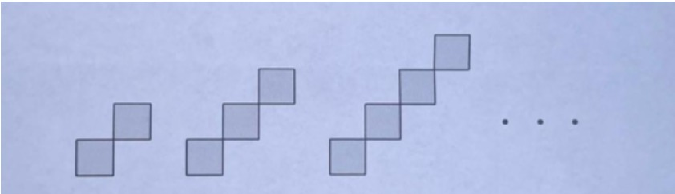

# Problemset 01

*Prepared by Chams Eddine Abdelali Derreche*

## Problem 1

Alice and Kheira play the following game: starting with the number $2$ written on a blackboard, each player in turn changes the current number $n$ to a number $n + p$, where $p$ is a prime divisor of $n$. Alice goes first and the players alternate in turn. The game is lost by the one who is forced to write a number greater than $\underbrace{22\ldots2}_{2020}$.

Assuming perfect play, who will win the game?

## Problem 2

Omar has an $m \times n$ board and wants to fill it with pieces composed of two or more diagonally connected squares as shown, without overlapping or leaving gaps:

1. Find all values of $(m,n)$ for which it is possible to fill the board.

2. If it is possible to fill an $m \times n$ board, find the minimum number of pieces Omar can use to fill it.

*Note: The pieces can be rotated.*

## Problem 3

Several positive integers are written in a row. Iteratively, Elyas chooses two adjacent numbers $x$ and $y$ such that $x>y$ and $x$ is to the left of $y$, and replaces the pair $(x,y)$ by either $(y+1,x)$ or $(x-1,x)$. Prove that he can perform only finitely many such iterations.

## Problem 4

Let $n$ be an positive integer. Find the smallest integer $k$ with the following property; Given any real numbers $a_1 , \cdots , a_d $ such that $a_1 + a_2 + \cdots + a_d = n$ and $0 \le a_i \le 1$ for $i=1,2,\cdots ,d$, it is possible to partition these numbers into $k$ groups (some of which may be empty) such that the sum of the numbers in each group is at most $1$.

## Problem 5

Redhouane and Kheira play a game. At the beginning, Redhouane writes down a positive integer on the board. Then the players take moves in turn, Kheira moves first. On any move of his, Kheira replaces the number $n$ on the blackboard with a number of the form $n-a^2$, where $a$ is a positive integer. On any move of hers, Redhouane replaces the number $n$ on the blackboard with a number of the form $n^k$, where $k$ is a positive integer. Kheira wins if the number on the board becomes zero.

Can Redhouane prevent Kheira’s win? 
