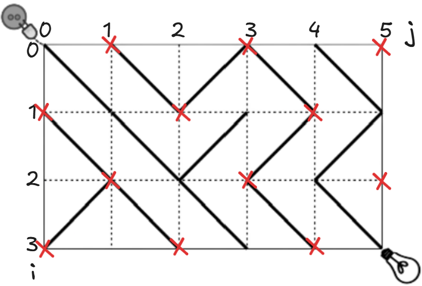

# Switch

Written by _Fares Khelif_.


## Problem Statement

- [English](statements/switch.pdf)
- [Arabic](statements/switch (ar_DZ).pdf)

## Solution

### "NO SOLUTION" Case
- We can notice that the electricity moves diagonally, so we can mark the points between squares as the points where the electricity settles.
- Consider a checkerboard: squares with `(i+j)` even are light, and `(i+j)` odd are dark.Since it is impossible to move from dark squares to light ones (or the opposite), any point with `(i+j)` odd is unreachable. As we start from `(0, 0)` where `(i+j)` is even, all odd-parity points are marked UNREACHABLE, as shown in the illustration :  
- So if ((n-1)+(m-1)) which simplifies to `(n+m)` is odd, then the answer would be "NO SOLUTION".

### Find the solution when it exists 
1. The cost to reach a point `[i, j]` is the minimum over all incoming diagonals: previous cost + 0 if the tile already aligns, or +1 if it must be turned.
   So we can consider the whole circuit as a weighted graph, and the tiles as undirected edges, and the points between the squares as nodes. If the tile is ready to transfer the electricity from a point to another then the weight is 0, otherwise it's 1.
2. We can implement Dijkstra's algorithm to find the shortest path from the source to the lamp.

## Implementation 
```cpp
#include <bits/stdc++.h>  
using namespace std;  
#define endl '\n'  
using ll  = long long;  
using pll = pair<ll, ll>;  
  
  
void solve() {  
    ll n, m; cin >> n >> m;  
    vector<string> a(n);  
    for (ll i = 0; i < n; i++) cin >> a[i];  
    if ((n+m)%2==1) {  
        cout << "NO SOLUTION" << endl;  
        return;  
    }  
  
    vector<vector<vector<pair<ll, vector<ll>>>>> graph(n+1, vector<vector<pair<ll, vector<ll>>>>(m+1));  
  
    for (ll i = 0; i < n; i++) {  
        for (ll j = 0; j < m; j++) {  
            if ((i+j)%2==0) {  
                if (a[i][j] == '\\') {  
                    graph[i][j].push_back({0, {i+1, j+1}});  
                    graph[i+1][j+1].push_back({0, {i, j}});  
                }  
                else {  
                    graph[i][j].push_back({1, {i+1, j+1}});  
                    graph[i+1][j+1].push_back({1, {i, j}});  
                }  
            }  
            else {  
                if (a[i][j] == '/') {  
                    graph[i+1][j].push_back({0, {i, j+1}});  
                    graph[i][j+1].push_back({0, {i+1, j}});  
                }  
                else {  
                    graph[i+1][j].push_back({1, {i, j+1}});  
                    graph[i][j+1].push_back({1, {i+1, j}});  
                }  
            }  
        }  
    }  
    vector<vector<ll>> ans(n+1, vector<ll>(m+1, 1e18));  
    ans[0][0] = 0;  
    priority_queue<pair<ll, vector<ll>>, vector<pair<ll, vector<ll>>>, greater<pair<ll, vector<ll>>>> pq; // {cost of reaching, x, y}  
    pq.push({0,{0, 0}});  
    while (!pq.empty()) {  
        auto v = pq.top();  
        ll w = v.first, x = v.second[0], y = v.second[1];  
        pq.pop();  
        for (auto c : graph[x][y]) {  
            if (ans[c.second[0]][c.second[1]] > w+c.first) {  
                ans[c.second[0]][c.second[1]] = w+c.first;  
                pq.push({ans[c.second[0]][c.second[1]], {c.second[0], c.second[1]}});  
            }  
        }  
    }  
    cout << ans[n][m] << endl;  
}  
int main() {  
    ios_base::sync_with_stdio(false);  
    cin.tie(nullptr);  
    //___________________________  
    solve();  
    return 0;  
}
```

### Time complexity Analysis
- The solution is implementing Dijkstra's algorithm, whose time complexity is `O(E * log V)` 
- Since we have `(n+1) * (m+1)` nodes, the complexity is `O((n*m) log(n*m))`, which is about `4.4 * 10^6` operations and sufficient for the constraints.